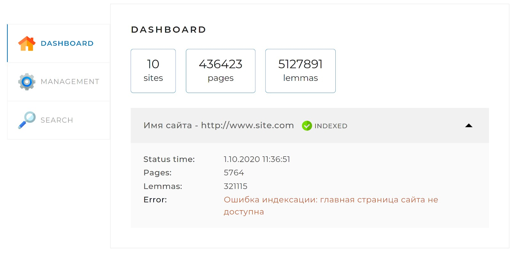
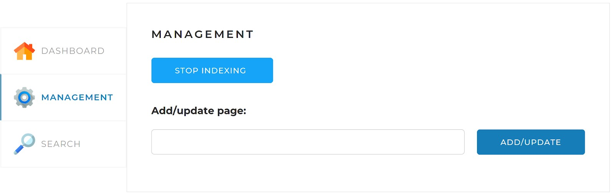
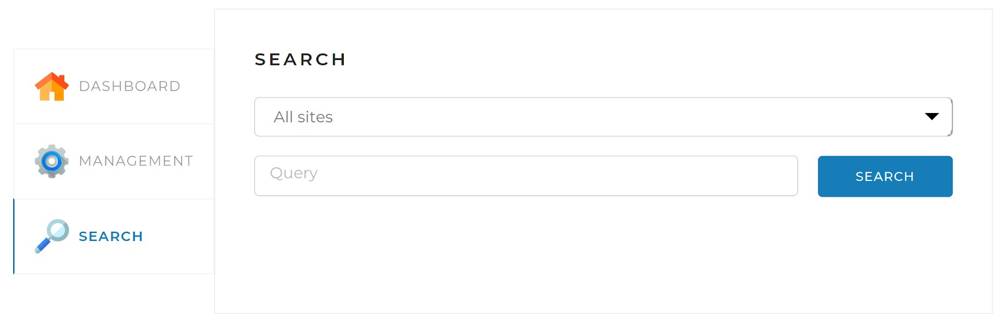

# Локальный поисковый движок по сайту

Поисковый движок представляет из себя Spring-приложение (JAR-файл, запускаемый на любом сервере или компьютере), работающее с локально установленной базой данных MySQL, имеющее простой веб-интерфейс и API, через который им можно управлять и получать результаты поисковой выдачи по запросу.

### Принципы работы поискового движка:

1. В конфигурационном файле перед запуском приложения задаются адреса сайтов, по которым движок должен осуществлять поиск (url должен заканчиваться знаком "/").

2. Поисковый движок должен самостоятельно обходить все страницы заданных сайтов и индексировать их (создавать так называемый индекс) так, чтобы потом находить наиболее релевантные страницы по любому поисковому запросу.

3. Пользователь присылает запрос через API движка. Запрос — это набор слов, по которым нужно найти страницы сайта.

4. Запрос определённым образом трансформируется в список слов, переведённых в базовую форму. Например, для существительных — именительный падеж, единственное число.

5. В индексе ищутся страницы, на которых встречаются все эти слова.

6. Результаты поиска ранжируются, сортируются и отдаются пользователю.

## Dashboard
Эта вкладка открывается по умолчанию. На ней отображается общая статистика по всем сайтам (уже добавленым в бд), а также детальная статистика и статус по каждому из сайтов.

## Management
На этой вкладке находятся инструменты управления поисковым движком — запуск и остановка полной индексации (переиндексации), а также возможность добавить (обновить) отдельную страницу по ссылке. Чтобы добавить или обновить отдельную страницу, она должна находиться в пределах сайтов, указанных в конфигурационном файле либо уже присутствующих в базе данных.

Если необходимо добавить или обновить главную страницу сайта, ссылка обязательно должна завершаться символом /. Для всех остальных страниц символ / в конце указывать не нужно.

## Search

Эта страница предназначена для тестирования поискового движка. На ней находится поле поиска, выпадающий список с выбором сайта для поиска, а при нажатии на кнопку «Search» выводятся результаты поиска. По умолчанию выводиться по 10 страниц, начиная с самых релевантных. Если страниц более 10, то появляется дополнительная кнопка "show more" и позволяет вывести большее количество страниц.

